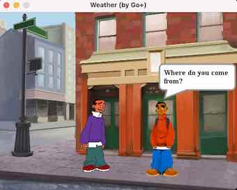
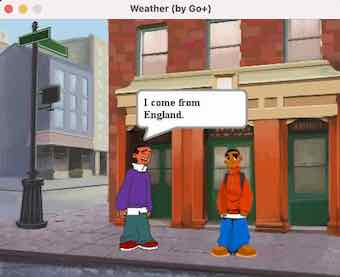

spx - A 2D Game Engine for learning Go+
========

[](https://github.com/goplus/spx/actions/workflows/go.yml)
[](https://goreportcard.com/report/github.com/goplus/spx)
[](https://github.com/goplus/spx/releases)
[](https://github.com/goplus/gop)
[](https://pkg.go.dev/mod/github.com/goplus/spx)

## Tutorials

### tutorial/01-Weather

 

Through this example you can learn how to listen events and do somethings.

Here is some codes in [Kai.spx](tutorial/01-Weather/Kai.spx):

```sh
onStart => {
	setCostume "kai-a"
	play recordingWhere
	say "Where do you come from?", 2
	broadcast "1"
}

onMsg "2", => {
	play recordingCountry
	say "What's the climate like in your country?", 3
	broadcast "3"
}

onMsg "4", => {
	play recordingBest
	say "Which seasons do you like best?", 3
	broadcast "5"
}
```

We call `onStart` and `onMsg` to listen events. `onStart` is called when the program is started. And `onMsg` is called when someone call `broadcast` to broadcast a message.

When the program starts, Kai says `Where do you come from?`, and then broadcasts the message `1`. Who will recieve this message? Let's see codes in [Jaime.spx](tutorial/01-Weather/Jaime.spx):

```sh
onMsg "1", => {
	play recordingComeFrom
	say "I come from England.", 2
	broadcast "2"
}

onMsg "3", => {
	play recordingMild
	say "It's mild, but it's not always pleasant.", 4
    # ...
	broadcast "4"
}
```

Yes, Jaime recieves the message `1` and says `I come from England.`. Then he broadcasts the message `2`. Kai recieves it and says `What's the climate like in your country?`.

The following procedure is very similar. In this way you can implement dialogues between multiple actors.

### tutorial/02-Dragon


Through this example you can learn how to define variables and show them on the stage.

Here is all the codes of [Dragon](tutorial/02-Dragon/Dragon.spx):

```sh
var (
	score int
)

onStart => {
	score = 0
	for {
		turn rand(-30, 30)
		step 5
		if touching("Shark") {
			score++
			play chomp, true
			step -100
		}
	}
}
```

We define a variable named `score` for `Dragon`. After the program starts, it moves randomly. And every time it touches `Shark`, it gains one score.

How to show the `score` on the stage? You don't need write code, just add a `stageMonitor` object into [resources/index.json](tutorial/02-Dragon/resources/index.json):

```json
{
  "zorder": [
    {
      "type": "stageMonitor",
      "target": "Dragon",
      "val": "getVar:score",
      "color": 15629590,
      "label": "score",
      "mode": 1,
      "x": 5,
      "y": 5,
      "visible": true
    }
  ]
}
```
